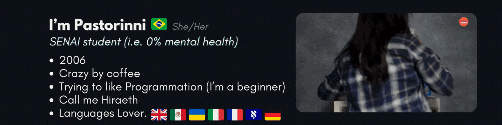
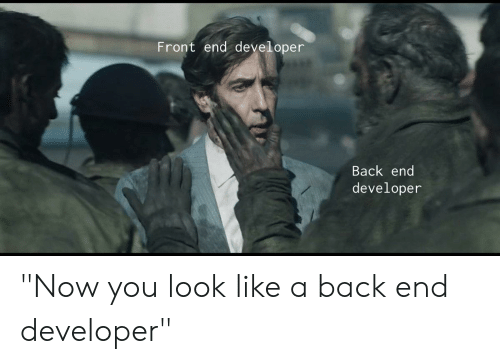

### Hi there 👋🏻
 </img>
 </img>

<i>"Sometimes I think i will be crazy having classes with Carlos, but i still fine".</i> <strong>Pastorinni, Anonimus (2024)</strong>

 
<h2>Memes Section</h2>
  

       </img>
       </img>
       </img>
       </img>
       </img>
       </img>
       </img>
       </img>
       </img>
       </img>
       </img>
       </img>
<!--        </img> -->
       </img>
       </img>
       </img>
       </img>
       </img>
       </img>
       </img>
       </img>
       </img>
       </img>
       </img>
       </img>
       </img>
       </img>
       </img>
       </img>
       </img>
       </img>
       </img>
       </img>
  

